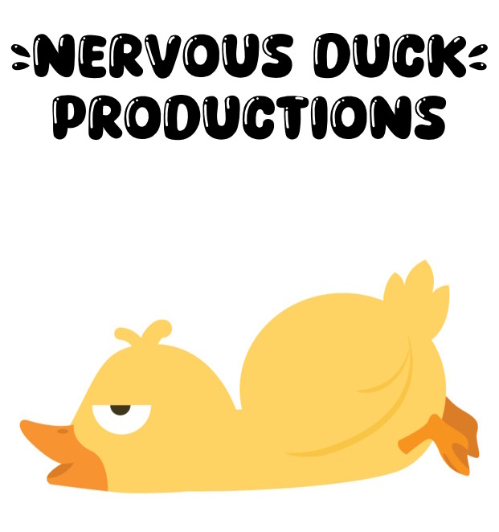

# Marvel Versus

## Description

Our team has a great enjoyment of both Marvel characters and video games. We wanted to bring that enjoyment to our players by combining our individual skills and styles into our very own Marvel video game! Creativity and most importantly fun were our driving motivators. 

This game features an alternate timeline where a villain has collected several characters from the Marvel universe and forces them to fight in teams to see who will win. Players can enjoy creating teams of their favorite Marvel characters and pitting them against The Collector and his teams. 

From navigating Marvel's API, calling selected data into elements using JavaScript, and balancing life's demands, our team has grown and learned an incredible amount in the time it has taken to get this project ready to launch. We are excited to share our game with you!

## Table of Contents

- [Installation](#installation)
- [Usage](#usage)
- [Credits](#credits)
- [License](#license)
- [Thank You!](#thanks)

## Installation

This game is meant to be played in the browser here: https://katherine-be.github.io/marvel-project/

## Usage

This game is designed to be easy to pick up and play. Once the page loads a cutscene will play along with text to introduce the story. After the window is closed players then choose their team of 3 (a team of less than 3 can be chosen, but beware! This puts the player at a significant disadvantage!)

Once the player is ready, click the fight button to see how your team fairs. Results will be displayed along with a small cutscene depending on the outcome. Refresh the page afterwords and repeat! Try different combinations or even pick your favorite character more then once! Multiverse theory! 

## Credits
* Marvel API: https://developer.marvel.com/

* YouTube API: https://developers.google.com/youtube/v3  

* General Reference: https://www.w3schools.com/  

* JavaScript dynamic image element creation: https://www.tutorialspoint.com/how-to-create-an-image-element-dynamically-using-javascript  

* Adding text to an existing element in JavaScript: https://stackoverflow.com/questions/41764061/adding-text-to-an-existing-text-element-in-javascript-via-dom  

* Adding elements into an array using JavaScript: https://habtesoft.medium.com/add-elements-to-an-array-in-javascript-a9cc6cd9469f  

* Sum of elements in an array: https://www.geeksforgeeks.org/program-find-sum-elements-given-array/  

* ChatGPT: https://chat.openai.com/  

* SFX: https://www.sounds-resource.com/search/?q=street+fighter&c=-1&o%5B%5D=s&o%5B%5D=ig&o%5B%5D=g  

* Modals: https://sweetalert2.github.io/#input-types
 
 * Duck Vector Image: https://www.vecteezy.com/vector-art/6792315-cute-yellow-duck-cartoon-collection  

## License

N/A

## Badges

## Features

Easy to pick up and play. Endless gameplay with over 200 team combinations and more on the way! Immersive story with cutscenes and text based storytelling. 

## How to Contribute

If you would like to help production of Marvel Versus play test and submit any bugs here: 
nervousduckproductions@gmail.com

## Thank You!

This project was lovingly developed by the Nervous Duck Pro'duck'tions Team: 
 * <a href="https://github.com/Katherine-Be" class="button big">Katherine-Be</a>
 * <a href="https://github.com/LaneNathan" class="button big">Nathan Lane</a>
 * <a href="https://github.com/stevelomax1" class="button big">Steve Lomax</a>
 * <a href="https://github.com/ChrisVulpine" class="button big">Chris Leach</a> 

 Thank you all for your support! You are all wonderful and majestic. 🐤

